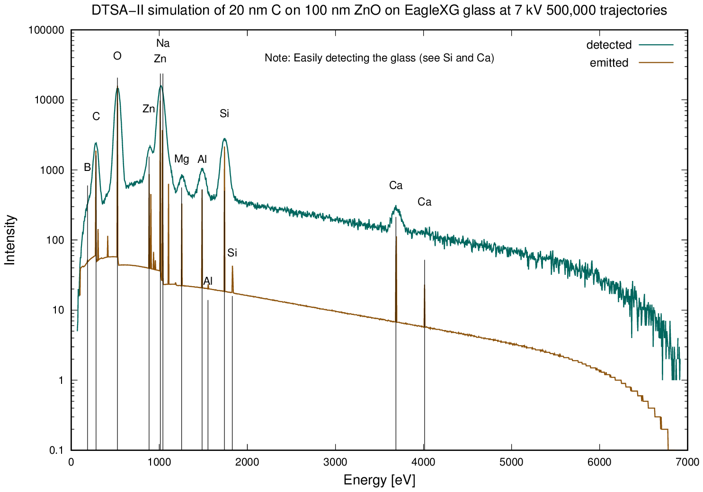
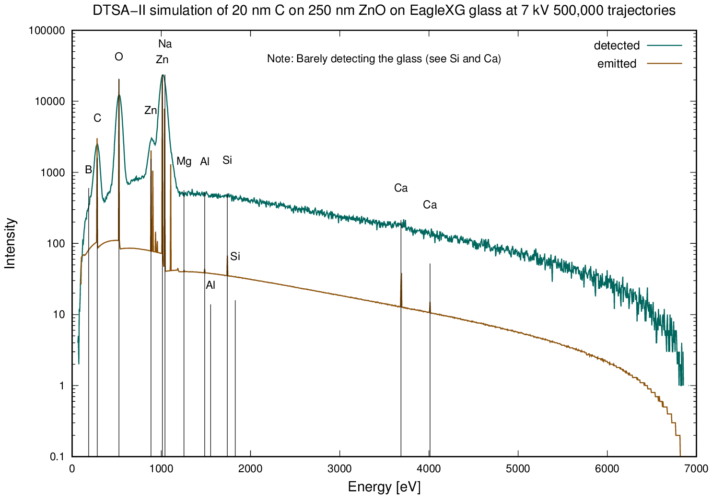

## Analysis of C-coated ZnO on Eagle-XG glass

This is a system that is of interest for spatial atomic layer deposition
(SALD).  In this case it shows how to model thin layers on a substrate
that can be used to do layer thickness analysis with either GMRFilm or
Stratagem. EagleXG glass is a popular substrate supplied by Corning Glass.
I simulated the composition by using the midpoint values in their
patent.

## Analysis with DTSA-II

In the latest release of DTSA-II, Nicholas Ritchie changed the default
`Simulation Alien` to compute both the emitted and detected spectrum.
He has not updated the the `mcSimulate3.py` library to do this from
python scripts. Returning a list of spectra (with `detected` and `emitted`)
would break may existing scripts that expect a single spectrum to be returned.
The code to make the change was available and I have developed and submitted
for evaluation a python library (`jmcSimulate3.py`) that is designed to 
return a list of spectra. This was a good opportunity to test this code.
I chose a 20 nm C layer thickness because it is a "standard" coating used
for EDS and microprobe analysis. I chose 7kV for an accelerating voltage because
it is sensitive to thin films. In practice, one would use a series of voltages
(i.e 5, 7, 10, and 15 kV) to get an overdetermined problem. I chose 500,000
trajectories as a good balance between S/N ratio and computation time
(around 2 hrs per simulation).

## Analysis of 20 nm of C on 100 nm of ZnO on Eagle XG Glass

In this case the beam penetrates the ZnO layer and there is reasonable
transmission of the X-rays from all layers through the specimen.

## Analysis of 20 nm of C on 250 nm of ZnO on Eagle XG Glass

In this case the ZnO layer is sufficiently thick to absorb
and there the X-rays from the glass.

