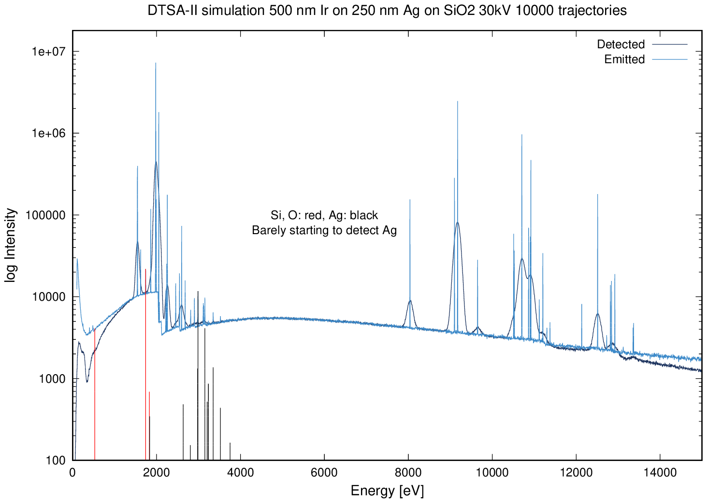
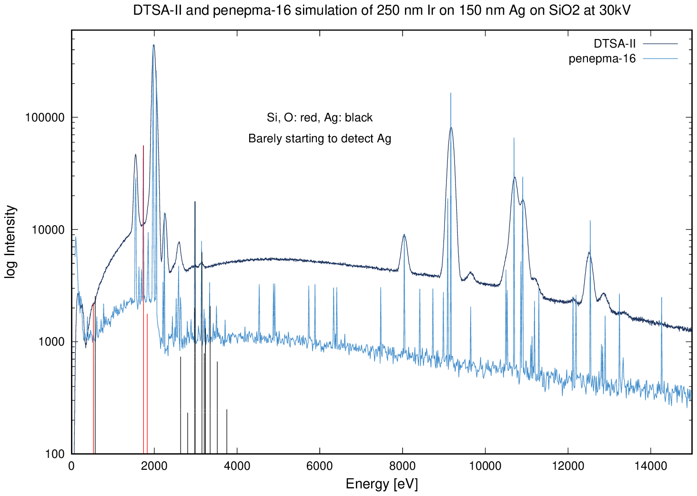

```{r setup, include=FALSE}
knitr::opts_chunk$set(echo = TRUE)
```

## Analysis of layers of Ir and Ag on a silica substrate

This is the system that inspired this repository. The problem was presented by
the user `Farqhuit` on the Probe Software Forum
[here](http://probesoftware.com/smf/index.php?topic=1104.0). This caught my
interest because he described the system like this:

> The thin iridium film (light area) in the map image, has a thin silver
> underlayer and both are on a silica substrate. Thicknesses to be
> determined, probably around 500 nm for the Ir, and much thinner for the
> silver.

Iridium (Z=77, density=22.56 g/cm3) is a heavy metal and can absorb X-rays.
[Armstrong and Crispin](https://www.cambridge.org/core/journals/microscopy-and-microanalysis/article/ultrathin-iridium-as-a-replacement-coating-for-carbon-in-high-resolution-quantitative-analyses-of-insulating-specimens/E112CCE091EA0D98244C5670186CB24F)
have demonstrated that a 5 nm film is conductive and so thin
coatings are useful where one wants to measure C. This alerted me to the need
to do some modeling. I also used the opportunity to script some of the analysis
in DTSA-II and to get get penepma-16 running and get some confidence using it.
I'm retired. This is fun and intellectually stimulating,

## Materials

The parameter needed to generate the material files for penepma are:

```
Ir: (Z=77) density = 22.56 g/cm3
Ag: (Z=47) density = 10.5 g/cm3
SiO2: Si (Z-14) and O (Z=8) density = 2.65 g/cm3
```

**Note:** One needs to generate material files using the `material.exe`
program from the version of penelope/penepma that you are using. I have
included my exemplar `.geo` files. 

Note that the `pen-2016` has the files I used with `penepma16`.


## Results

### 500 nm Ir on 250 nm Ag on Silica at 30 kV 

Note that DTSA-II and penepma-16 simulations run using the initial
description of a 500 nm Ir layer on a 250 nm layer of Ag on SiO_2
at **30 kV** did not detect significant Ag! 500 nm of Ir is
**not thin**! These were 5 hour simulations.


DTSA-II can also simulate the "emitted" and "detected" spectra. This simulation
is shown below:



### 250 nm Ir on 150 nm Ag on Silica at 30 kV 

Now let's reduce the layer thickness and run the penepma-16 simulation
again with penepma-16 and DTSA-II. Now we finally start to detect Ag.




### What to do?

One could measure an unknown from the top down by measuring elemental standards
and determining the K-ratios for transitions of interest from the unknowns at
multiple (at least 3 voltages) and compute the K-ratios. One could then use
a program like GMRFilm or Stratagem (commercial) and compute the layer
thickness values. This **only** works when the system is over-determined.
To measure the thickness of Ir and Ag you would need k-ratios for at least 3
and preferably 5 voltages. Having done this, I can report that it is
**a lot of work**. It would make sense if you had a lot of specimens to run 
and you collect the data from many samples at the same sitting. One still
needs a way to validate the results.

IMHO, a great approach would be to take a specimen with layer thickness
estimates in the middle of the range and cut a trench in a Focused Ion 
Beam instrument and directly measure the layer thickness values. One really
need to do this to validate the other approach. Yes, it is expensive.

Ask yourself: **What is the cost of being wrong?** There is a time to
pinch the pennies. If the results count, management needs to find the
money...
 

