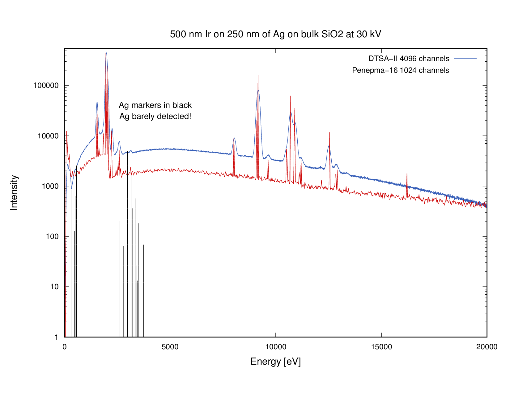

## Analysis of layers of Ir and Ag on a silica substrate

This is the system that inspired this repository. The problem was presented by
the user `Farqhuit` on the Probe Software Forum
[here](http://probesoftware.com/smf/index.php?topic=1104.0). This caught my
interest because he described the system like this:

> The thin iridium film (light area) in the map image, has a thin silver
> underlayer and both are on a silica substrate. Thicknesses to be
> determined, probably around 500 nm for the Ir, and much thinner for the
> silver.

Iridium (Z=77, density=22.56 g/cm3) is a heavy metal and can absorb X-rays.
[Armstrong and Crispin](https://www.cambridge.org/core/journals/microscopy-and-microanalysis/article/ultrathin-iridium-as-a-replacement-coating-for-carbon-in-high-resolution-quantitative-analyses-of-insulating-specimens/E112CCE091EA0D98244C5670186CB24F)
have demonstrated that a 5 nm film is conductive and so thin
coatings are useful where one wants to measure C. This alerted me to the need
to do some modeling.

## Materials

The parameter needed to generate the material files for penepma are:

```
Ir: (Z=77) density = 22.56 g/cm3
Ag: (Z=47) density = 10.5 g/cm3
SiO2: Si (Z-14) and O (Z=8) density = 2.65 g/cm3
```

**Note:** One needs to generate material files using the `material.exe`
program from the version of penelope/penepma that you are using. I have
included my exemplar `.geo` files. 

Note that the `pen-2016` has the files I used with `penepma16`.


## Results

Note that DTSA-II and penepma-16 simulations run using the initial
description of a 500 nm Ir layer on a 250 nm layer of Ag on SiO_2
at **30 kV** did not detect significant Ag! 500 nm of Ir is
**not thin**!


