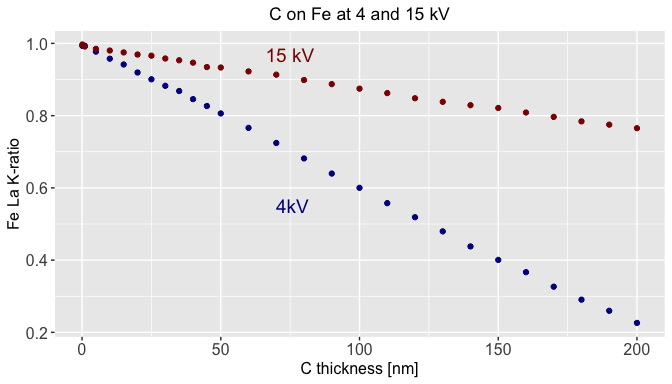
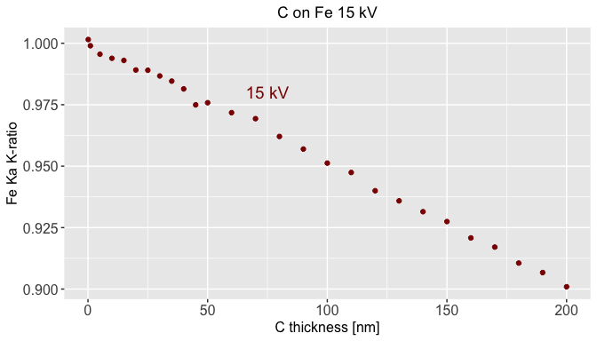

# Set up for the analysis


First load the libraries we need...


```r
library(here)
library(rpenepma)
library(dplyr)
library(readr)
library(pander)
panderOptions('table.split.table', Inf)
library(ggplot2)
```

Next, set the paths and constants that we need...


```r
sim_dir <- here()

fi_4kV  <- sprintf("%s/dtsa2-C-on-Fe-4-kV-kratios-50000-traj.csv", sim_dir)
fi_4kV
```

```
[1] "C:/Users/jrminter/Documents/git/monte-carlo-simulations/dtsa2/ana-dtsa2-C-on-Fe-by-kV/dtsa2-C-on-Fe-4-kV-kratios-50000-traj.csv"
```

```r
fi_15kV <- sprintf("%s/dtsa2-C-on-Fe-15-kV-kratios-50000-traj.csv", sim_dir)
df_4kV <- read_csv(fi_4kV)
df_15kV <- read_csv(fi_15kV)
print(head(df_15kV))
```

```
# A tibble: 6 x 7
   t_nm k_c_k_mu k_c_k_un k_fe_l_mu k_fe_l_un k_fe_k_mu k_fe_k_un
  <dbl>    <dbl>    <dbl>     <dbl>     <dbl>     <dbl>     <dbl>
1   0.1  0.00193  0.00001     0.997   0.00027     1.00   0.000300
2   1    0.00245  0.00001     0.991   0.00027     0.999  0.000300
3   5    0.00489  0.00002     0.985   0.00027     0.996  0.000300
4  10    0.00788  0.00002     0.980   0.00027     0.994  0.000300
5  15    0.0109   0.00002     0.975   0.00027     0.993  0.000300
6  20    0.0140   0.00002     0.969   0.00027     0.989  0.00029 
```


Plot CKa


```r
c_ka_plt <- ggplot() +
            geom_point(data=df_4kV, aes(x=t_nm, y=k_c_k_mu),  colour="darkblue") +
            geom_point(data=df_15kV, aes(x=t_nm, y=k_c_k_mu),  colour="darkred") +
            xlab("C thickness [nm]") +
            ylab("C Ka K-ratio") +
            ggtitle("C on Fe at 4 and 15 kV") +
            annotate("text", label = ' 4kV', x = 75, y = 0.5, size = 5,
                     color = "darkblue") +
            annotate("text", label = '15 kV', x = 75, y = 0.15, size = 5,
                     color = "darkred") +
            theme(axis.text=element_text(size=12),
                  axis.title=element_text(size=12),
                  plot.title=element_text(hjust = 0.5)) +  # center the title
            NULL

print(c_ka_plt)
```


Plot FeLa


```r
fe_la_plt <- ggplot() +
             geom_point(data=df_4kV, aes(x=t_nm, y=k_fe_l_mu),
                        colour="darkblue") +
             geom_point(data=df_15kV, aes(x=t_nm, y=k_fe_l_mu),
                        colour="darkred") +
             xlab("C thickness [nm]") +
             ylab("Fe La K-ratio") +
             ggtitle("C on Fe at 4 and 15 kV") +
             annotate("text", label = ' 4kV', x = 75, y = 0.55, size = 5,
                      color = "darkblue") +
             annotate("text", label = '15 kV', x = 75, y = 0.97, size = 5,
                      color = "darkred") +
             theme(axis.text=element_text(size=12),
                   axis.title=element_text(size=12),
                   plot.title=element_text(hjust = 0.5)) + 
             NULL

print(fe_la_plt)
```




Plot FeKa


```r
fe_ka_plt <- ggplot() +
             geom_point(data=df_15kV, aes(x=t_nm, y=k_fe_k_mu),
                        colour="darkred") +
             xlab("C thickness [nm]") +
             ylab("Fe Ka K-ratio") +
             ggtitle("C on Fe 15 kV") +
             annotate("text", label = '15 kV', x = 75, y = 0.98, size = 5,
                      color = "darkred") +
             theme(axis.text=element_text(size=12),
                   axis.title=element_text(size=12),
                   plot.title=element_text(hjust = 0.5)) + 
             NULL

print(fe_ka_plt)
```


