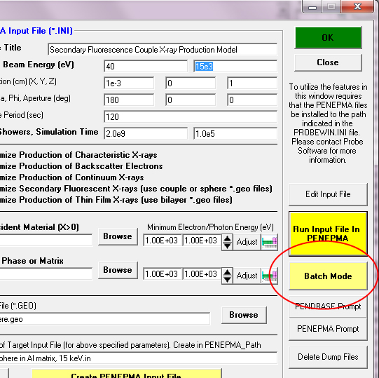
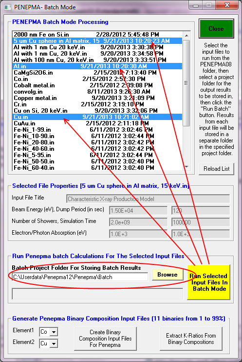
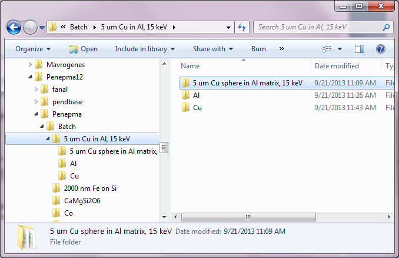

John Donovan has a helpful post on the
[Probe Software Forum](http://probesoftware.com/smf/index.php?topic=59.msg221#msg221). I always have to search to find it and want to make some notes here.

It is probably worth explaining how to calculate k-ratios from Penepma photon intensity calculations. Generally we want to utilize elemental k-ratios, therefore in addition to calculating the photon intensities for our unknown sample at the specific conditions and geometry desired, we will also need to calculate the pure element intensities for the element emission of interest at the same sample conditions, though generally for a bulk geometry.

Therefore at least two Penepma calculation models must be run, one for the unknown and one for the standard. Of course each element in the unknown calculation that will be converted to a k-ratio needs a (generally bulk) standard calculated also. In the above example of a Cu particle in an Al matrix that means three input files: one for the unknown inclusion in the matrix, one for the pure bulk Al and one for the pure bulk Cu.

The easiest way to do this is to utilize the "batch" mode of the Penepma GUI, by first generating the two input files from the Create PENEPMA Material and Input Files window which is accessed in the Standard.exe program from the Analytical | PENEPMA (Monte Carlo) Calculations menu.

Once all Penepma input files have been generated, simply click the Batch Mode button as seen here:



and then select the input files you want to run from the input file list. The basic calculation parameters are displayed as each input file is selected (use <ctrl> click for multiple selections), and when all input files have been selected, Browse to (and create if necessary) a folder to store your calculation results in as shown here:




Then simply click the Run Select Input Files In Batch Mode button.  The program will confirm the required calculation time and folder to save to (each calculation and output files will be automatically saved to a separate sub folder), and then simply click OK to start the calculation.

Extracting the intensities for k-ratio calculations:

Once all the Monte-Carlo calculations are complete, one browses to the batch output folders shown here:




Now locate the pe-intens-01.dat file in each folder and copy or note the transition intensity for each line that you desire to calculate k-ratio values for. The most common transitions are listed here:

```
K L3       ' (Ka) (see table 6.2 in Penelope-2006-NEA-pdf)
K M3       ' (Kb)
L3 M5      ' (La)
L2 M4      ' (Lb)
M5 N7      ' (Ma)
M4 N6      ' (Mb)
```


An example from one of the three output files is shown here, specifically the unknown sample (Cu hemisphere in Al):

```

 #  Results from PENEPMA. Output from photon detector #  1
 #
 #  Angular intervals : theta_1 = 4.500000E+01,  theta_2 = 5.500000E+01
 #                        phi_1 = 0.000000E+00,    phi_2 = 3.600000E+02
 #
 #  Intensities of characteristic lines. All in 1/(sr*electron).
 #    P = primary photons (from electron interactions);
 #    C = flourescence from characteristic x rays;
 #    B = flourescence from bremsstrahlung quanta;
 #   TF = C+B, total fluorescence;
 #  unc = statistical uncertainty (3 sigma).
 #
 # IZ S0 S1  E (eV)      P            unc       C            unc       B            unc       TF           unc       T            unc
   29 L1 M3  1.0228E+03  1.954288E-06 2.68E-07  0.000000E+00 0.00E+00  2.207194E-09 2.50E-09  2.207194E-09 2.50E-09  1.956495E-06 2.68E-07
   29 L1 M2  1.0228E+03  1.162781E-06 2.06E-07  0.000000E+00 0.00E+00  1.576567E-09 2.12E-09  1.576567E-09 2.12E-09  1.164358E-06 2.06E-07
   29 L1 M4  1.0927E+03  1.223980E-08 2.12E-08  0.000000E+00 0.00E+00  0.000000E+00 0.00E+00  0.000000E+00 0.00E+00  1.223980E-08 2.12E-08
   29 L1 M5  1.0930E+03  4.079933E-09 1.22E-08  0.000000E+00 0.00E+00  0.000000E+00 0.00E+00  0.000000E+00 0.00E+00  4.079933E-09 1.22E-08
   13  K L2  1.4863E+03  2.744367E-09 2.93E-09  3.577180E-08 1.11E-08  9.888903E-08 1.65E-08  1.346608E-07 2.76E-08  1.374052E-07 2.01E-08
   13  K L3  1.4867E+03  8.534549E-09 5.16E-09  6.731252E-08 1.52E-08  1.939424E-07 2.31E-08  2.612549E-07 3.84E-08  2.697895E-07 2.82E-08
   13  K M2  1.5576E+03  0.000000E+00 0.00E+00  0.000000E+00 0.00E+00  6.028973E-10 1.28E-09  6.028973E-10 1.28E-09  6.028973E-10 1.28E-09
   13  K M3  1.5576E+03  0.000000E+00 0.00E+00  7.692860E-10 1.63E-09  9.043460E-10 1.57E-09  1.673632E-09 3.20E-09  1.673632E-09 2.26E-09
   29  K L2  8.0278E+03  1.026919E-05 6.15E-07  0.000000E+00 0.00E+00  2.809442E-07 2.86E-08  2.809442E-07 2.86E-08  1.055014E-05 6.16E-07
   29  K L3  8.0478E+03  2.028543E-05 8.64E-07  0.000000E+00 0.00E+00  5.410777E-07 4.01E-08  5.410777E-07 4.01E-08  2.082651E-05 8.66E-07
   29  K M2  8.9054E+03  1.244380E-06 2.13E-07  0.000000E+00 0.00E+00  2.680164E-08 8.82E-09  2.680164E-08 8.82E-09  1.271181E-06 2.14E-07
   29  K M3  8.9054E+03  2.570358E-06 3.07E-07  0.000000E+00 0.00E+00  6.747706E-08 1.39E-08  6.747706E-08 1.39E-08  2.637835E-06 3.08E-07
   29  K M4  8.9771E+03  4.079933E-09 1.22E-08  0.000000E+00 0.00E+00  0.000000E+00 0.00E+00  0.000000E+00 0.00E+00  4.079933E-09 1.22E-08

```


If we are interested in the Al Ka and Cu Ka emissions we simply note the "K L3" photon intensity values in the T column (total intensity and its uncertainty (unc) just to the right). 

Remembering that the <K ratio intensity> = <Unk intensity> / <Std intensity>, we save these unknown photon intensity values to be the numerators for our k-ratios. Note that in the case of the K emissions we may also include the Kb emission intensity to improve our precision, by adding in the contribution of the Kb "K M3" transition, since all K emissions are emitted from the same edge.

Now, obtain the same corresponding "K L3" photon intensity values from the pure (bulk) Al and pure (bulk) Cu folder pe-intens-01.dat files and insert the the corresponding intensity values in the denominator of our k-ratio equation to calculate the elemental k-ratio for Al Ka and Cu Ka in our unknown sample relative to the pure elements.

Houston: we have k-ratios!


