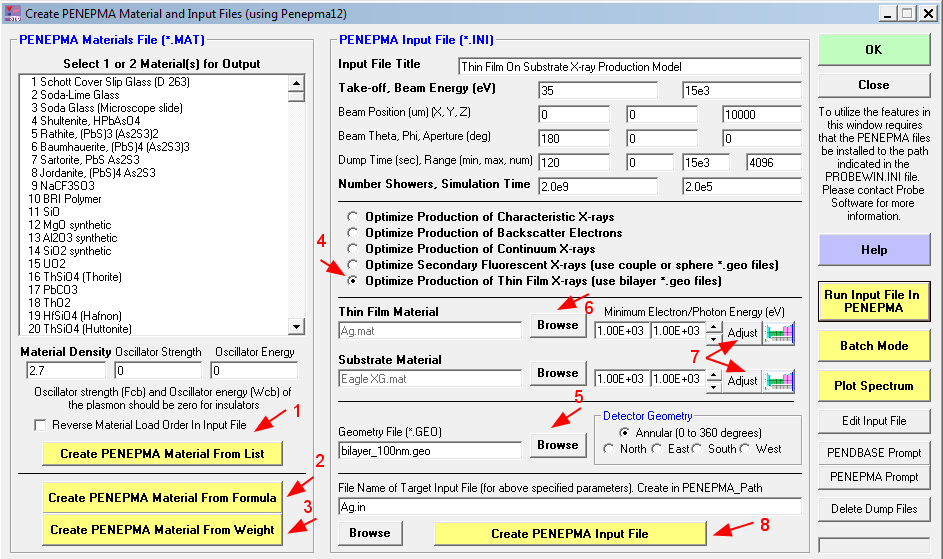

## Introduction

The `simulation_name.in` file needs a list of configuration variables
for each material. The easiest way that I have found to get reasonable
starting values is to use the `Standard` program that comes with
`CalcZAF`. Choose the `Analytical > Penepma (Monte Carlo) Calculations`
choice from the menu-bar. This starts the
`create PENEPMA Materials and Input Files (using Penepma12)` dialog.



## Choosing the parameter values for a material

1. You can create a material file several ways. See the red arrows labeled
`2`, `2`, and `3`. Note that you can set the density from the dialog.
These material files **only work with penepma12**. 

2. This is most useful for making material parameters for multi-layer thin
film simulations where you craft input files by hand. So make sure you
chose the `Optimize the Production of thin Film X-rays` (number `4`) and a
`bilayer_xxnm.geo` file. You can choose materials and geo files
using the buttons labeled `5` and `6`. Select the materials you are interested
in.

3. Notice the `Adjust` and `Periodic Table` buttons labeled `7`. Hitting adjust
will compute the values from the `.mat1` file. The `Periodic Table` button 
presents a dialog where you can select elements. These seem to produce the same
values with consistent input.

4. When you are done with the choices, press the `Create PENAPMA Input File`
button. This will have the name of your top material and the file extension
`.in`, so the data in the image would produce `Ag.in`. On my Win 7 system
this is in `C:\UserData\Penepma12\Penepma`. The directory is set in 
`C:\ProgramData\Probe Software\Probe for EPMA\probewin.ini` in the
line (81) `PENEPMA_Path="C:\Userdata\Penepma12\Penepma"`.

## Example values


These were generated as described above. These can be re-used for
similar simulations. Note: `amC.mat` is amorphous C with the density
set to 1.35 g/cm3.


```
MFNAME AmC.mat                        [Material file, up to 20 chars]
MSIMPA 2.7E+2 2.7E+2 1E+3 0 0 0 -1E+2       [EABS(1:3),C1,C2,WCC,WCR]
```

```
MFNAME ZnO.mat                        [Material file, up to 20 chars]
MSIMPA 8.5E+3 8.5E+3 1E+3 0 0 0 -1E+2       [EABS(1:3),C1,C2,WCC,WCR]
```

```
MFNAME SiO2.mat                       [Material file, up to 20 chars]
MSIMPA 5.1E+2 5.1E+2 1E+3 0 0 0 -1E+2       [EABS(1:3),C1,C2,WCC,WCR]
```

```
MFNAME Ir.mat                         [Material file, up to 20 chars]
MSIMPA 1.0E+3 1.0E+3 1E+3 0 0 0 -1E+2       [EABS(1:3),C1,C2,WCC,WCR]
```

```
MFNAME Eagle XG.MAT                   [Material file, up to 20 chars]
MSIMPA 1.8E+2 1.8E+2 1E+3 0 0 0 -1E+2       [EABS(1:3),C1,C2,WCC,WCR]
```

Ag - from material file:

```
MFNAME Ag.mat                         [Material file, up to 20 chars]
MSIMPA 2.9E+3 2.9E+3 1E+3 0 0 0 -1E+2       [EABS(1:3),C1,C2,WCC,WCR]
```

Ag - from element choices:

```
MFNAME Ag.mat                         [Material file, up to 20 chars]
MSIMPA 2.9E+3 2.9E+3 1E+3 0 0 0 -1E+2       [EABS(1:3),C1,C2,WCC,WCR]
```


