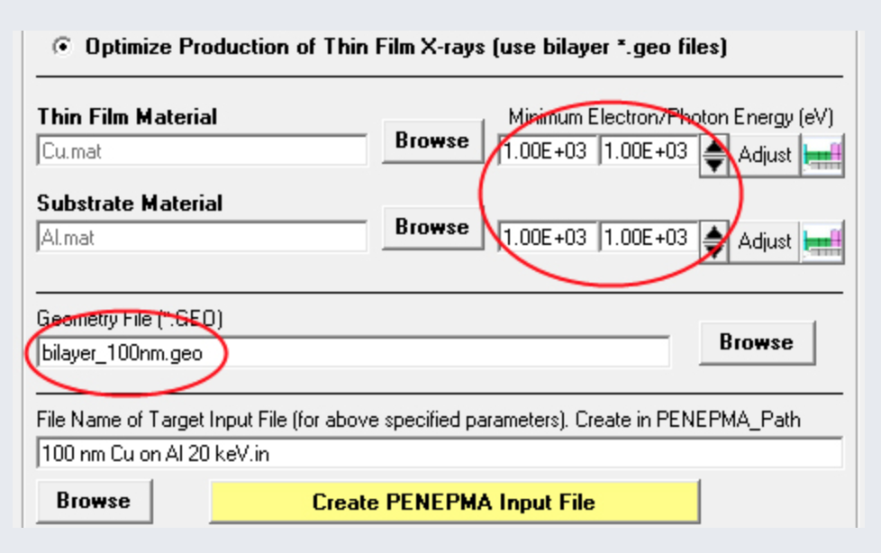
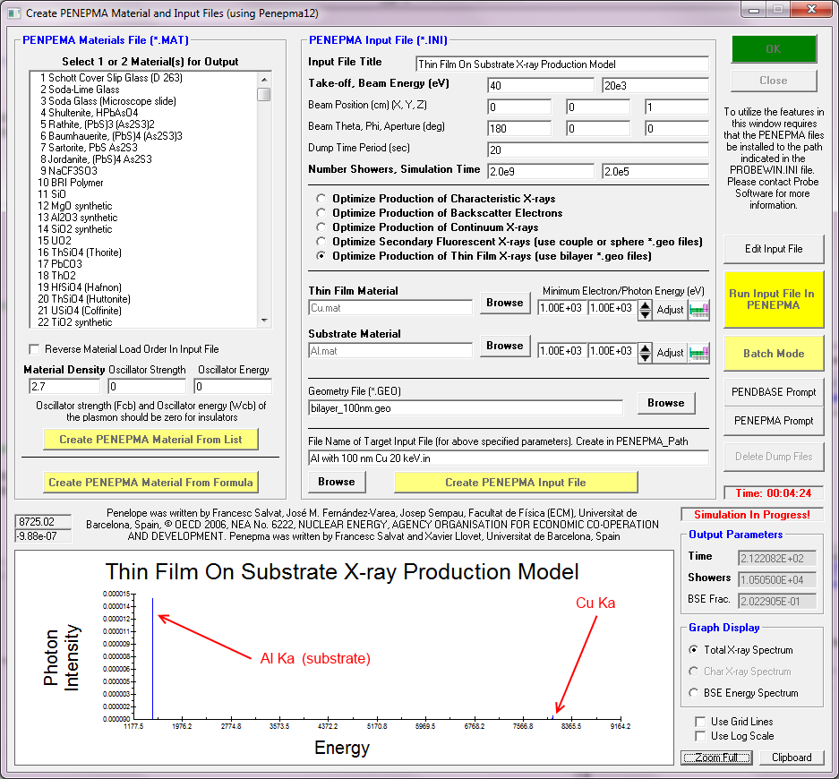

## [Jon Wade](https://probesoftware.com/smf/index.php?topic=202.msg7487#msg7487)

2018-08-07

Purely from recollection, for an epma with a take off angle of 40
degrees, the `.in` takeoff angle may need to be amended (measured
from the vertical) And, personally speaking, I think, rather than
running for a set time, **its better to use the REFLIN option** to
specify an error on a line of interest.

Other things of note  - c1 and c2 should be checked to see if they
influence the results.  Experience says maybe not, but depending
on what your trying to achieve, they should be checked with short
runs.  Efficiency is definitely optimised by choosing the input
parameters - especially the cutoffs -  in this line carefully.

Actually, is anyone interested in an 'end users' guide to penepma?
Once I fully understand some of the more esoteric details of the
new version, I don't mind putting something together detailing this,
`.geo` and a basic guide to Penelope for xrf and the like (this will
mean I have to bribe Xavier with a beer for three!).  But only if
there's interest...

The PENELOPE family, together with the Salvat database on cross sections
are excellent resources for  things as diverse as BSE and X-ray yield
across a range of analytical techniques.  The authors really cannot be
given enough credit for a serious contribution and  should be both
applauded and supported.


## [Jon Wade](https://probesoftware.com/smf/index.php?topic=637.msg3764#msg3764)

2015-12-03

I'm being a bit thick - whats the axes on your graphs? (Ben Buse
responded: `cm`)

Call me a heretic (burn him!), but if you're editing the .in file, you
may well be better off running penepma as a standalone - there are some
funky options for speeding up the simulation in the latest version, and
hey, its fun.  Or at least, its what passes for fun around here....
If you yell, theres a big bearded chap hanging around your lab with the
latest versions about his person, and no, he's not Father Christmas.

I'll also add that you should keep an eye on the error column of the
output.  As a proportion of total counts, I guess far fewer will
originate outside the interaction volume as the spot gets bigger
(as a proportion of total counts),  so at least to me, your
result is not entirely unexpected.


 
## [John Donovan](https://probesoftware.com/smf/index.php?topic=57.msg208#msg208)

2014-01-22

As many of you know, one can model thin film geometries using the
Penepma 12 GUI in Standard.exe.

Provided are a number of Penepma thin film geometry files as follows:

```
bilayer_1nm.geo
bilayer_2nm.geo
bilayer_5nm.geo
bilayer_10nm.geo
bilayer_20nm.geo
bilayer_50nm.geo
bilayer_100nm.geo
bilayer_200nm.geo
bilayer_500nm.geo
bilayer_1000nm.geo
bilayer_2000nm.geo
```

The thin film calculations using these geometry files require two
materials to be specified, the first is the thin film material and
the second is the substrate:



This simple interface will get you started with thin film Monte-Carlo
modeling. **One thing to keep in mind: generally one will want to set**
**the electron/photon minimum energies to be the same, usually just**
**under the critical excitation energy of the lowest energy emission**
**line to be observed.**

Note: Some early versions of the Penepma12.zip distribution had a bug
where if you tried to calculate a thin film model using the default
`bilayer_100nm.geo` file, the Penepma app will run for about a 30 seconds
and then close. The problem was that the bilayer_100nm.geo file was not
in the Penepma folder where Penepma expected it to be, so it failed with
an EOF error.

This has been fixed in the current CalcZAF distribution and
Penepma12.ZIP download files, but to correct this problem on
an existing installation simply click the geometry file `Browse`
button and navigate up one folder level and select the
`bilayer_100nm.geo` file, or any other `bilayer_*.geo` file.

A Monte-Carlo calculation using the above parameters will look like
the attached screen shot.



