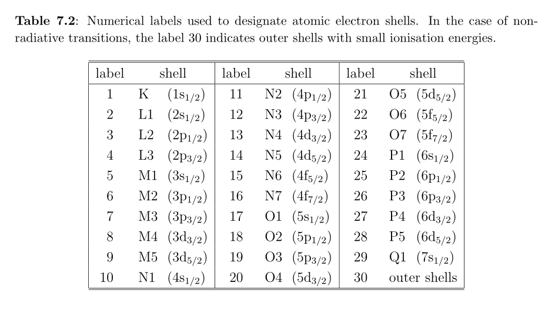

```{r setup, include=FALSE}
knitr::opts_chunk$set(echo = TRUE)
```

## Introduction

We have two methods to have penepma stop the simulation. The first is to 
run for a specified time (in sec) - `TIME`, not to exceed a number of showers
(i.e. trajectories) `NSIMSH`. The second method is to use the `REFLIN` parameter
to run to a desired precision for a particular transition. This is encoded in
a manner that we need **Table 7.2** (**p. 274**) from the NEA document by F. Salvat,
*PENELOPE, a code system for Monte Carlo simulation of electron and photon transport*
(2014). The table is reproduced below.



## Computing the `REFLIN` line

The `penepma16` source code gives this explanation for computing the `REFLIN`
line in the simulation file:

```
[IZ*1e6+S1*1e4+S2*1e2,detector,tol.]
```

Consider the case of Ir (Z=77). Jon Wade provided this example:

```
REFLIN 77081500 2 1.E-2
```

In this case the element was Iridium (`Z = 77`). `S1` (from **Table 7.2**)
was `08` which corresponds to the `M4` shell. `S2` (from **Table 7.2**) was `15`
which corresponds to the `N6` shell. So we are considering the `M4-N6`
transition.

I checked the transitions with DTSA-II `listTransitions('Ir')` function.
I obtained the table below that I cropped to the transitions with a large weight.

```
IUPAC     Weight  Energy  Wavelength
                  (keV)     (Å)
Ir M5-N6  1.0000  1.977   6.27133
Ir M5-N7  1.0000  1.9799  6.26214
Ir M4-N6  0.5944  2.0527  6.04005
Ir L3-M5  1.0000  9.1748  1.35136
Ir L2-M4  0.4168  10.708  1.15787
```


I a assume Jon Wade choose the lower weighted `M4-N6` because
**if those statistics were good, the higher weighted** `L3-M5`
**would be better**.


