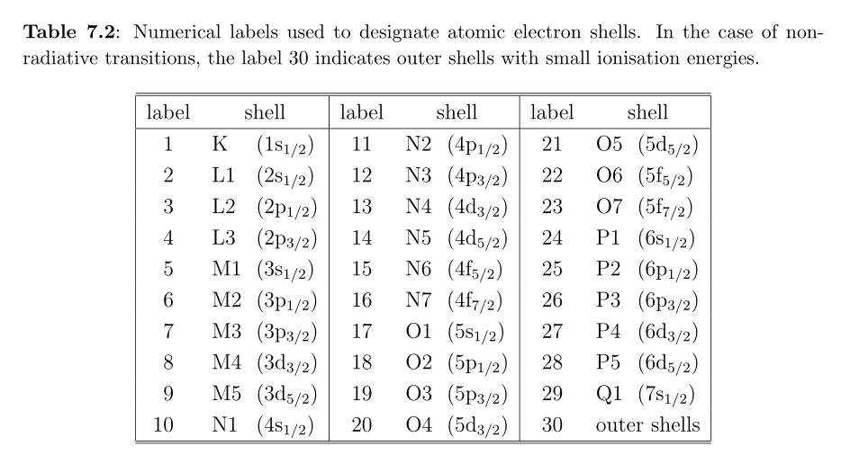

## Introduction

We have two methods to have penepma stop the simulation. The first is to 
run for a specified time (in sec) - `TIME`, not to exceed a number of showers
(i.e. trajectories) `NSIMSH`. The second method is to use the `REFLIN` parameter
to run to a desired precision for a particular transition. This is encoded in
a manner that we need **Table 7.2** (**p. 274**) from the NEA document by F. Salvat,
*PENELOPE, a code system for Monte Carlo simulation of electron and photon transport*
(2014). The table is reproduced below.



## Computing the `REFLIN` line

The `penepma16` source code gives this explanation for computing the `REFLIN`
line in the simulation file:

```
[IZ*1e6+S1*1e4+S2*1e2,detector,tol.]
```

and adds

```
REFLIN : The simulation will be discontinued when the relative
         statistical uncertainty (3*sigma) of the intensity of line
         IZS1S200 [note the final double zero] in detector IDET is
         less than the tolerance TOL.
```

Note that the `pe-intens-01.dat` file reports that the uncertainty
values reported are at the `3*sigma` level.

Consider the case of Ir (Z=77). Jon Wade provided this example:

```
REFLIN 77081500 2 1.E-2
```

In this case the element was Iridium (`Z = 77`). `S1` (from **Table 7.2**)
was `08` which corresponds to the `M4` shell. `S2` (from **Table 7.2**) was `15`
which corresponds to the `N6` shell. So we are considering the `M4-N6`
transition.

I checked the transitions with DTSA-II `listTransitions('Ir')` function.
I obtained the table below that I cropped to the transitions with a large weight.

```
IUPAC     Weight  Energy  Wavelength
                  (keV)     (Å)
Ir M5-N6  1.0000  1.977   6.27133
Ir M5-N7  1.0000  1.9799  6.26214
Ir M4-N6  0.5944  2.0527  6.04005
Ir L3-M5  1.0000  9.1748  1.35136
Ir L2-M4  0.4168  10.708  1.15787
```


I assume Jon Wade choose the lower weighted `M4-N6` because
**if those statistics were good, the higher weighted** `L3-M5`
**would be better**.


## What about the detector?

The comments tell us:

> Each detector collects photons that leave the sample with directions
> within a 'rectangle' on the unit sphere, limited by the 'parallels'
> `THETA1` and `THETA2` and the 'meridians' `PHI1` and `PHI2`. 
> The output spectrum is the energy distribution of photons that emerge within
> the acceptance solid angle of the detector with energies in the interval
> from `EDEL` to `EDEU`, recorded using `NCHE` channels. **Notice that the**
> **spectrum is given in absolute units** (per incident particle, per eV
> and per unit solid angle).

In the cases below the `IPSF` parameter is 0. The description tells us:

> IPSF=0, the psf is not created.    
> IPSF=1, a psf is created.    
> IPSF>1, a psf is created, but contains only state variables
> of detected photons that have ILB(4)=IPSF (used for studying angular
> distributions of x rays).


I wanted to see what an annular detector entry would look like, so I created one
using the GUI in the `penepma12` implementation that comes with the `Standard`
program with `CalcZAF`. I used this detector in my simulation of 
`20-nm-C-250-nm-ZnO-Silica-reflin`. 

```
PDANGL 50.0 60.0 0.0 360.0 0           [Angular window, in deg, IPSF]
```

The description of this field is

```
PDANGL THETA1,THETA2,PHI1,PHI2,IPSF    [Angular window, in deg, IPSF]
```

so the detector described would be an annular detector that collected X-rays
with a takeoff angle between 50 and 60 degrees.
This is still a long simulation... After just under 16 hrs, we are at
`4.9e+05` trajectories... It will be interesting to see when it shuts down...


