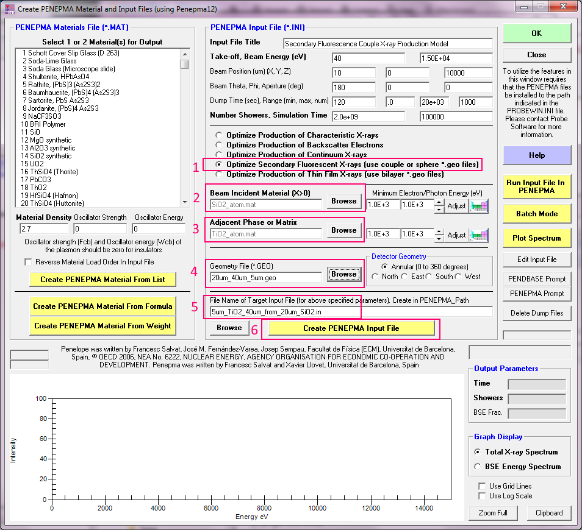
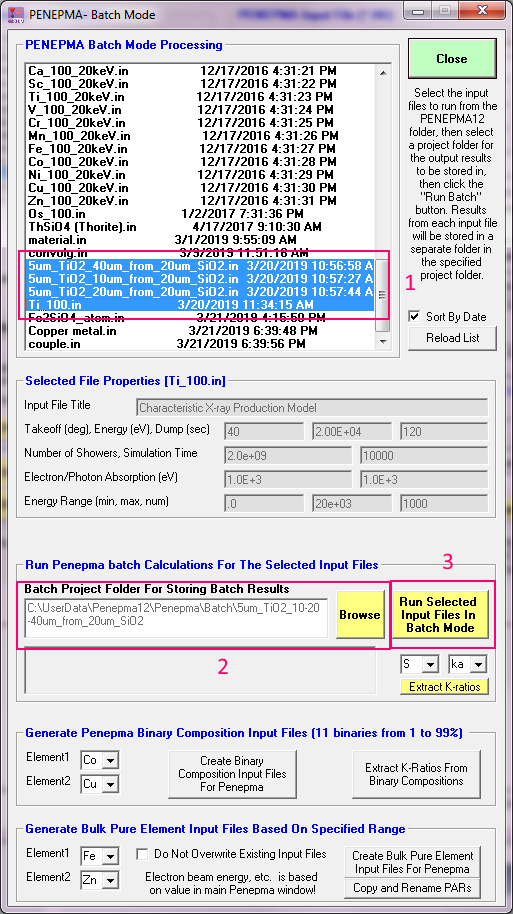

# Introduction

This introduction comes from the Probe Software Forum [here](https://probesoftware.com/smf/index.php?topic=58.msg8146#msg8146).

> I am reminded of a talk I heard here a few weeks ago from a highly regarded
> Professor at a California school which shall remain nameless.  There was a
> particular slide claiming to see differential diffusion profiles towards a
> grain boundary.  Some quick modeling after the talk showed that it could all
> be explained by secondary fluorescence.  I know the three Jo/h/n's (Wade,
> Donovan, and Fournelle) are adamant about trying to educate the public.
> What can we do to actually make this point sink in? 
> 
> Anyways:  There are essentially two solutions to this problem as Ben mentioned
> 
> 1. Acquire the data normally and run it through PENEPMA, modeling the influence
> of secondary fluorescence.  Then removing the influence of secondary
> fluorescence on each data point during the transect towards the grain boundary.
> A bit time consuming right now, but I wonder if PfEPMA wouldn't be able to do
> that quite easily now that is has the modeling built in...
> 
> 2. Alternatively use the non-traditional lines J.D. mentioned and use low
> accelerating potential (<8 keV).  The influence of secondary fluorescence goes
> away for most elements in this case.  You could also use the normal L lines
> if all you are after is the diffusion profile, and not absolute concentrations.

John Donovan noted:

> I realize this is a two year old post, but it's worth mentioning again that
> now there is a geology paper on these SF effects:
> [here](https://www.sciencedirect.com/science/article/pii/S0009254118302304).
>
> Here's the geometry for a .geo file that we need from a Penepma .geo file
> expert:


He added:

> The materials are arbitrary, we just need help with creating the .geo file.
> The beam position could be varied but normally we'd put it in the center of
> the 20 um inclusion.

Does anyone have a file of this (or similar) geometry that they can share with us?

[Phillipe Pinard](https://probesoftware.com/smf/index.php?topic=58.msg8172#msg8172)
supplied the [.geo](./inc/sio2-epoxy-tio2.geo) file. Note: I renamed the file to
make it more descriptive.

[Marisa Acosta](https://probesoftware.com/smf/index.php?topic=58.msg8176#msg8176)
asked:

> Thank you for your help! It is much appreciated. Just a  quick clarifying
> question - is the TiO~2~ inclusion shifted 40 micron with respect to the edge
> of the sphere or the center of it (i.e. is the center or the edge of the
> TiO~2~ inclusion 40 microns from the center of the SiO~2~ phase?)

[John Donovan](https://probesoftware.com/smf/index.php?topic=58.msg8177#msg8177)
clarified further:

> So converting the k-ratios to % k-ratio and applying a matrix correction
> of ~1.2 (TiO~2~ std k-factor = 0.5546) for Ti Ka in SiO~2~ we get the
> following results:

```{r makeTbale, echo=FALSE, message=FALSE, warning=FALSE}
library(here)
library(readr)
library(knitr)
fi <- here('penepma/penepma12/boundary-fluorescence/inc/jd.csv')
# print(fi)
tib <- read_tsv(fi)
kable(tib)
```

> Therefore we're seeing only about 1-2 PPM SF effect from a 5 um TiO~2~
> particle 40 (37.5) um away from our beam spot in SiO~2~.  I have to admit,
> it surprises me a bit that at 7.5 um from a 5 um particle and we're only
> getting 30 PPM of SF effect.   Can anyone confirm these calculations? 

[Phillipe Pinard](https://probesoftware.com/smf/index.php?topic=58.msg8180#msg8180)
supplied the python code (He named it epoxy.py, I saveed it as sio2-epoxy-tio2.py
in the `inc` folder...)

Phillipe noted:

> The 40um is from the center of each half-sphere. This distance is defined by
> the x-shift of the TiO~2~ inclusion.
>
> If it helps, I attached the Python script I used to create this geometry.
> You need Python3 and the 
> [pypenelopetools](https://github.com/pymontecarlo/pypenelopetools)
> library, which you should be able to install using:
>
> ```
> pip install pypenelopetools
> ```

# Penepma-Calczaf approac

[John Donovan](https://probesoftware.com/smf/index.php?topic=58.msg8193#msg8193)

Explained how he and Marissa carefully implemented their approach:

> I thought I would share how Marisa and I manually edited the Penepma .in input
> files to work with Penepma .geo files containing three materials.  This manual
> editing is necessary because the Penepma GUI in Standard only supports one or
> two materials. This two material limitation covers most modeling situations,
> e.g., a single phase (bulk.geo), a SF boundary fluorescence (couple.geo), a
> thin file on a substrate (bilayer_200nm.geo), and an inclusion in a matrix
> (50mic_sphere.geo).
>
> The reason for not supporting more than two materials in the Standard GUI is
> that the possible configurations gets complicated, and so it was decided to
> **limit the Penepma GUI in Standard to two materials**. But we can add a third
> material to the Penepma .in input files manually using a text editor, and then
> still be able to run these input files from the Penepma GUI in Batch Mode,
> which automatically copies each completed simulation to a specified subfolder
> for subsequent review and/or k-ratio extraction.
> 
> But first let me mention that after manually modifying the Penepma .in files
> for a third material and then reloading the modified .in file into the Penepma
> GUI, we discovered a small bug that caused an error message about a missing
> control index (for the manually edited third material).  This bug still
> allowed the batch mode option to run the simulation, but one had to
> "click through" the error message for each .in file containing more than two
> materials. **The current version of the Penepma GUI in Standard (update to PFE**
> **and CalcZAF v. 12.6.0) now handles three materials for running in batch mode**.
> But please note that loading a manually edited three material .in file into the
> Penepma GUI (by using the Browse button), and re-saving that .in file, will
> cause the third material to be excluded from the saved .in file. **Bottom line:**
> don't click the Create PENEPMA Input File button if your .in file contains
> more than two materials.  Or if you do, simply re-edit the .in file afterwards,
> by adding the third material manually, as I am about to describe below.
> 
> So, let's start by looking at a three material .geo file, specifically the
> one created by Philippe Pinard for two inclusions (each a different material)
> separated by a specified distance, in a matrix (a third material).

Note: changes are indicated with `<----` ...

```
XXXXXXXXXXXXXXXXXXXXXXXXXXXXXXXXXXXXXXXXXXXXXXXXXXXXXXXXXXXXXXXX
       Nasty fluorescence case
0000000000000000000000000000000000000000000000000000000000000000
SURFACE (   1) Plane Z=0.00 cm
INDICES=( 0, 0, 0, 1, 0)
X-SCALE=(+1.000000000000000E+00,   0)              (DEFAULT=1.0)
Y-SCALE=(+1.000000000000000E+00,   0)              (DEFAULT=1.0)
Z-SCALE=(+1.000000000000000E+00,   0)              (DEFAULT=1.0)
  OMEGA=(+0.000000000000000E+00,   0) DEG          (DEFAULT=0.0)
  THETA=(+0.000000000000000E+00,   0) DEG          (DEFAULT=0.0)
    PHI=(+0.000000000000000E+00,   0) DEG          (DEFAULT=0.0)
X-SHIFT=(+0.000000000000000E+00,   0)              (DEFAULT=0.0)
Y-SHIFT=(+0.000000000000000E+00,   0)              (DEFAULT=0.0)
Z-SHIFT=(+0.000000000000000E+00,   0)              (DEFAULT=0.0)
0000000000000000000000000000000000000000000000000000000000000000
SURFACE (   2) Sphere of radius 0.00 cm
INDICES=( 1, 1, 1, 0,-1)
X-SCALE=(+0.200000000000000E-02,   0)              (DEFAULT=1.0)
Y-SCALE=(+0.200000000000000E-02,   0)              (DEFAULT=1.0)
Z-SCALE=(+0.200000000000000E-02,   0)              (DEFAULT=1.0)
  OMEGA=(+0.000000000000000E+00,   0) DEG          (DEFAULT=0.0)
  THETA=(+0.000000000000000E+00,   0) DEG          (DEFAULT=0.0)
    PHI=(+0.000000000000000E+00,   0) DEG          (DEFAULT=0.0)
X-SHIFT=(+0.000000000000000E+00,   0)              (DEFAULT=0.0)
Y-SHIFT=(+0.000000000000000E+00,   0)              (DEFAULT=0.0)
Z-SHIFT=(+0.000000000000000E+00,   0)              (DEFAULT=0.0)
0000000000000000000000000000000000000000000000000000000000000000
SURFACE (   3) Sphere of radius 0.00 cm
INDICES=( 1, 1, 1, 0,-1)
X-SCALE=(+0.500000000000000E-03,   0)              (DEFAULT=1.0)
Y-SCALE=(+0.500000000000000E-03,   0)              (DEFAULT=1.0)
Z-SCALE=(+0.500000000000000E-03,   0)              (DEFAULT=1.0)
  OMEGA=(+0.000000000000000E+00,   0) DEG          (DEFAULT=0.0)
  THETA=(+0.000000000000000E+00,   0) DEG          (DEFAULT=0.0)
    PHI=(+0.000000000000000E+00,   0) DEG          (DEFAULT=0.0)
X-SHIFT=(+0.000000000000000E+00,   0)              (DEFAULT=0.0)
Y-SHIFT=(+0.000000000000000E+00,   0)              (DEFAULT=0.0)
Z-SHIFT=(+0.000000000000000E+00,   0)              (DEFAULT=0.0)
0000000000000000000000000000000000000000000000000000000000000000
SURFACE (   4) Cylinder of radius 3.00 cm along z-axis
INDICES=( 1, 1, 0, 0,-1)
X-SCALE=(+3.000000000000000E+00,   0)              (DEFAULT=1.0)
Y-SCALE=(+3.000000000000000E+00,   0)              (DEFAULT=1.0)
Z-SCALE=(+1.000000000000000E+00,   0)              (DEFAULT=1.0)
  OMEGA=(+0.000000000000000E+00,   0) DEG          (DEFAULT=0.0)
  THETA=(+0.000000000000000E+00,   0) DEG          (DEFAULT=0.0)
    PHI=(+0.000000000000000E+00,   0) DEG          (DEFAULT=0.0)
X-SHIFT=(+0.000000000000000E+00,   0)              (DEFAULT=0.0)
Y-SHIFT=(+0.000000000000000E+00,   0)              (DEFAULT=0.0)
Z-SHIFT=(+0.000000000000000E+00,   0)              (DEFAULT=0.0)
0000000000000000000000000000000000000000000000000000000000000000
MODULE  (   1) Inclusion TiO2  <---- changes...
MATERIAL(   2)                 <----
SURFACE (   1), SIDE POINTER=(-1)
SURFACE (   3), SIDE POINTER=(-1)
1111111111111111111111111111111111111111111111111111111111111111
  OMEGA=(+0.000000000000000E+00,   0) DEG          (DEFAULT=0.0)
  THETA=(+0.000000000000000E+00,   0) DEG          (DEFAULT=0.0)
    PHI=(+0.000000000000000E+00,   0) DEG          (DEFAULT=0.0)
X-SHIFT=(+0.525000000000000E-02,   0)              (DEFAULT=0.0)
Y-SHIFT=(+0.000000000000000E+00,   0)              (DEFAULT=0.0)
Z-SHIFT=(+0.000000000000000E+00,   0)              (DEFAULT=0.0)
0000000000000000000000000000000000000000000000000000000000000000
MODULE  (   2) Inclusion SiO2  <---- changes
MATERIAL(   3)                 <----
SURFACE (   1), SIDE POINTER=(-1)
SURFACE (   2), SIDE POINTER=(-1)
1111111111111111111111111111111111111111111111111111111111111111
  OMEGA=(+0.000000000000000E+00,   0) DEG          (DEFAULT=0.0)
  THETA=(+0.000000000000000E+00,   0) DEG          (DEFAULT=0.0)
    PHI=(+0.000000000000000E+00,   0) DEG          (DEFAULT=0.0)
X-SHIFT=(+0.000000000000000E+00,   0)              (DEFAULT=0.0)
Y-SHIFT=(+0.000000000000000E+00,   0)              (DEFAULT=0.0)
Z-SHIFT=(+0.000000000000000E+00,   0)              (DEFAULT=0.0)
0000000000000000000000000000000000000000000000000000000000000000
MODULE  (   3) matrix   <---- changes
MATERIAL(   1)          <----
SURFACE (   1), SIDE POINTER=(-1)
SURFACE (   4), SIDE POINTER=(-1)
MODULE  (   1)
MODULE  (   2)
1111111111111111111111111111111111111111111111111111111111111111
  OMEGA=(+0.000000000000000E+00,   0) DEG          (DEFAULT=0.0)
  THETA=(+0.000000000000000E+00,   0) DEG          (DEFAULT=0.0)
    PHI=(+0.000000000000000E+00,   0) DEG          (DEFAULT=0.0)
X-SHIFT=(+0.000000000000000E+00,   0)              (DEFAULT=0.0)
Y-SHIFT=(+0.000000000000000E+00,   0)              (DEFAULT=0.0)
Z-SHIFT=(+0.000000000000000E+00,   0)              (DEFAULT=0.0)
0000000000000000000000000000000000000000000000000000000000000000
END      0000000000000000000000000000000000000000000000000000000


```

> The lines highlighted in red above, indicate which material is assigned to
> each geometric body. In this particular .geo file,  material 2 is the TiO~2~
> inclusion (separated from the SiO~2~ inclusion by a non-zero distance),
> material 3 is the SiO~2~ inclusion (centered on the incident beam when th
> beam incident X/Y distances are zero), and material 1 is the matrix (SiO~2~
> or epoxy).  Note that these three geometric bodies could be any material
> (as defined in the .in file), and the comments in the .geo file are simply
> there to assist in their identification in the .geo file.  By the way, these
> .geo files are normally saved to the C:\UserData\Penepma12 folder.
> 
> So now we look at a corresponding .in file created using the Penepma GUI in
> Standard (note that the Penepma .in input files are normally stored in the
> `C:\UserData\Penepm12\Penepma folder`). Let's start with a two material .in
> file, by utilizing the default couple.geo file and modifying it for our two
> inclusion materials:



After the .in file is saved in the 6th step, let's look at it in a text editor:

```

TITLE  Secondary Fluorescence Couple X-ray Production Model
       .
       >>>>>>>> Electron beam definition.
SENERG 1.50E+04                  [Energy of the electron beam, in eV]
SPOSIT 0.001 0 1                 [Coordinates of the electron source]
SDIREC 180 0              [Direction angles of the beam axis, in deg]
SAPERT 0                                      [Beam aperture, in deg]
       .
       >>>>>>>> Material data and simulation parameters.
MFNAME SiO2_atom.mat                  [Material file, up to 20 chars]  <----
MSIMPA 1.0E+3 1.0E+3 1E+3 0.1 0.1 1E+3 1E+3 [EABS(1:3),C1,C2,WCC,WCR]  <----
MFNAME TiO2_atom.mat                  [Material file, up to 20 chars]  <----
MSIMPA 1.0E+3 1.0E+3 1E+3 0.1 0.1 1E+3 1E+3 [EABS(1:3),C1,C2,WCC,WCR]  <----
       .
       >>>>>>>> Geometry of the sample.
GEOMFN 20um_40um_5um.geo         [Geometry definition file, 20 chars]
DSMAX  1 1.5e-4             [IB, Maximum step length (cm) in body IB]
DSMAX  2 1.5e-4             [IB, Maximum step length (cm) in body IB]
       .
       >>>>>>>> Interaction forcing.
IFORCE 1 1 4 -10     0.1  1.0         [KB,KPAR,ICOL,FORCER,WLOW,WHIG]
IFORCE 1 1 5 -400   0.1  1.0          [KB,KPAR,ICOL,FORCER,WLOW,WHIG]
IFORCE 1 2 2 -10    1e-4 1.0          [KB,KPAR,ICOL,FORCER,WLOW,WHIG]
IFORCE 1 2 3 -10    1e-4 1.0          [KB,KPAR,ICOL,FORCER,WLOW,WHIG]
IFORCE 2 1 4 -10     0.1  1.0         [KB,KPAR,ICOL,FORCER,WLOW,WHIG]
IFORCE 2 1 5 -400   0.1  1.0          [KB,KPAR,ICOL,FORCER,WLOW,WHIG]
IFORCE 2 2 2 -10    1e-4 1.0          [KB,KPAR,ICOL,FORCER,WLOW,WHIG]
IFORCE 2 2 3 -10    1e-4 1.0          [KB,KPAR,ICOL,FORCER,WLOW,WHIG]
       .
       >>>>>>>> Photon detectors (up to 10 different detectors).
PDANGL 45.0 55.0 0.0 360.0 0           [Angular window, in deg, IPSF]
PDENER .0 20e+03 1000                [Energy window, no. of channels]
       .
       .
       >>>>>>>> Job properties
RESUME dump1.dat               [Resume from this dump file, 20 chars]
DUMPTO dump1.dat                  [Generate this dump file, 20 chars]
DUMPP  120                                   [Dumping period, in sec]
       .
NSIMSH 2.0e+09                  [Desired number of simulated showers]
RSEED  1 1                     [Seeds of the random-number generator]
TIME   100000                      [Allotted simulation time, in sec]
```


> In this case material 1 is the first material (SiO~2~), and material 2
> is the second material (TiO2). These material designations could be
> reversed if the beam incident and boundary materials were swapped in the
> Penepma GUI. 

> Now we know from our .geo file that we need the following material ordering:
>

```
Material 1 = matrix (SiO2 or epoxy for these particular set of simulations)
Material 2 = TiO2
Material 3 = SiO2
```

> So we need to add a third material for the matrix (SiO~2~ or epoxy) and
> then **re-arrange** the order of the TiO~2~ and SiO~2~ materials as seen here:

```
TITLE  Secondary Fluorescence Couple X-ray Production Model
       .
       >>>>>>>> Electron beam definition.
SENERG 1.50E+04                  [Energy of the electron beam, in eV]
SPOSIT 0.001 0 1                 [Coordinates of the electron source]
SDIREC 180 0              [Direction angles of the beam axis, in deg]
SAPERT 0                                      [Beam aperture, in deg]
       .
       >>>>>>>> Material data and simulation parameters.
MFNAME Epon 828 Epoxy.mat             [Material file, up to 20 chars] <----
MSIMPA 1.0E+3 1.0E+3 1E+3 0.1 0.1 1E+3 1E+3 [EABS(1:3),C1,C2,WCC,WCR] <----
MFNAME TiO2_atom.mat                  [Material file, up to 20 chars] <----
MSIMPA 1.0E+3 1.0E+3 1E+3 0.1 0.1 1E+3 1E+3 [EABS(1:3),C1,C2,WCC,WCR] <----
MFNAME SiO2_atom.mat                  [Material file, up to 20 chars] <----
MSIMPA 1.0E+3 1.0E+3 1E+3 0.1 0.1 1E+3 1E+3 [EABS(1:3),C1,C2,WCC,WCR] <----
       .
       >>>>>>>> Geometry of the sample.
GEOMFN 20um_40um_5um.geo         [Geometry definition file, 20 chars]
DSMAX  1 1.5e-4             [IB, Maximum step length (cm) in body IB]
DSMAX  2 1.5e-4             [IB, Maximum step length (cm) in body IB]
       .
       >>>>>>>> Interaction forcing.
IFORCE 1 1 4 -10     0.1  1.0         [KB,KPAR,ICOL,FORCER,WLOW,WHIG]
IFORCE 1 1 5 -400   0.1  1.0          [KB,KPAR,ICOL,FORCER,WLOW,WHIG]
IFORCE 1 2 2 -10    1e-4 1.0          [KB,KPAR,ICOL,FORCER,WLOW,WHIG]
IFORCE 1 2 3 -10    1e-4 1.0          [KB,KPAR,ICOL,FORCER,WLOW,WHIG]
IFORCE 2 1 4 -10     0.1  1.0         [KB,KPAR,ICOL,FORCER,WLOW,WHIG]
IFORCE 2 1 5 -400   0.1  1.0          [KB,KPAR,ICOL,FORCER,WLOW,WHIG]
IFORCE 2 2 2 -10    1e-4 1.0          [KB,KPAR,ICOL,FORCER,WLOW,WHIG]
IFORCE 2 2 3 -10    1e-4 1.0          [KB,KPAR,ICOL,FORCER,WLOW,WHIG]
       .
       >>>>>>>> Photon detectors (up to 10 different detectors).
PDANGL 45.0 55.0 0.0 360.0 0           [Angular window, in deg, IPSF]
PDENER .0 20e+03 1000                [Energy window, no. of channels]
       .
       .
       >>>>>>>> Job properties
RESUME dump1.dat               [Resume from this dump file, 20 chars]
DUMPTO dump1.dat                  [Generate this dump file, 20 chars]
DUMPP  120                                   [Dumping period, in sec]
       .
NSIMSH 2.0e+09                  [Desired number of simulated showers]
RSEED  1 1                     [Seeds of the random-number generator]
TIME   100000                      [Allotted simulation time, in sec]

```

> Note that if one has utilized different SIMPA values for each material, you
> will want to move those lines along with their corresponding MFNAME lines.
> But in this case all the minimum electron/photon energies are 1 keV for all
> three materials.
> 
> Now finally one can go to the Batch Mode window from the Penepma GUI and
> select the .in files to run as seen here where we created different .geo files
> with different distances, but we used the same .in file, except of course for
> the Ti standard which will get used for extracting the k-ratios once it's all
> finished the simulations (note the Ti standard only needs to run a short time
> compared to the SF inclusion simulations which are expected to be in the PPM
> range):



> It's so *simple*...     :)   seriously though, it's a lot simpler than
> editing everything by hand, and besides, the two material GUI works for
> almost all modeling situations.
> 
> And you didn't forget the specify the correct beam energy in the .in files for
> all the models, right? 
