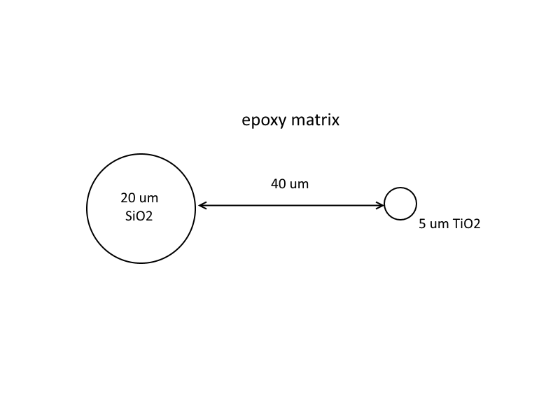

# Introduction

This introduction comes from the Probe Software Forum [here](https://probesoftware.com/smf/index.php?topic=58.msg8146#msg8146).

> I am reminded of a talk I heard here a few weeks ago from a highly regarded
> Professor at a California school which shall remain nameless.  There was a
> particular slide claiming to see differential diffusion profiles towards a
> grain boundary.  Some quick modeling after the talk showed that it could all
> be explained by secondary fluorescence.  I know the three Jo/h/n's (Wade,
> Donovan, and Fournelle) are adamant about trying to educate the public.
> What can we do to actually make this point sink in? 
> 
> Anyways:  There are essentially two solutions to this problem as Ben mentioned
> 
> 1. Acquire the data normally and run it through PENEPMA, modeling the influence
> of secondary fluorescence.  Then removing the influence of secondary
> fluorescence on each data point during the transect towards the grain boundary.
> A bit time consuming right now, but I wonder if PfEPMA wouldn't be able to do
> that quite easily now that is has the modeling built in...
> 
> 2. Alternatively use the non-traditional lines J.D. mentioned and use low
> accelerating potential (<8 keV).  The influence of secondary fluorescence goes
> away for most elements in this case.  You could also use the normal L lines
> if all you are after is the diffusion profile, and not absolute concentrations.

John Donovan noted:

> I realize this is a two year old post, but it's worth mentioning again that
> now there is a geology paper on these SF effects:
> [here](https://www.sciencedirect.com/science/article/pii/S0009254118302304).
>
> Here's the geometry for a .geo file that we need from a Penepma .geo file
> expert:


He added:

> The materials are arbitrary, we just need help with creating the .geo file.
> The beam position could be varied but normally we'd put it in the center of
> the 20 um inclusion.

Does anyone have a file of this (or similar) geometry that they can share with us?

[Phillipe Pinard](https://probesoftware.com/smf/index.php?topic=58.msg8172#msg8172)
supplied the [.geo](./inc/sio2-epoxy-tio2.geo) file. Note: I renamed the file to
make it more descriptive.

[Marisa Acosta](https://probesoftware.com/smf/index.php?topic=58.msg8176#msg8176)
asked:

> Thank you for your help! It is much appreciated. Just a  quick clarifying
> question - is the TiO~2~ inclusion shifted 40 micron with respect to the edge
> of the sphere or the center of it (i.e. is the center or the edge of the
> TiO~2~ inclusion 40 microns from the center of the SiO~2~ phase?)

[John Donovan](https://probesoftware.com/smf/index.php?topic=58.msg8177#msg8177)
clarified further:

> So converting the k-ratios to % k-ratio and applying a matrix correction
> of ~1.2 (TiO~2~ std k-factor = 0.5546) for Ti Ka in SiO~2~ we get the
> following results:

```{r makeTbale, echo=FALSE, message=FALSE, warning=FALSE}
library(here)
library(readr)
library(knitr)
fi <- here('penepma/penepma12/boundary-fluorescence/inc/jd.csv')
# print(fi)
tib <- read_tsv(fi)
kable(tib)
```

> Therefore we're seeing only about 1-2 PPM SF effect from a 5 um TiO~2~
> particle 40 (37.5) um away from our beam spot in SiO~2~.  I have to admit,
> it surprises me a bit that at 7.5 um from a 5 um particle and we're only
> getting 30 PPM of SF effect.   Can anyone confirm these calculations? 

[Phillipe Pinard](https://probesoftware.com/smf/index.php?topic=58.msg8180#msg8180)
supplied the python code (He named it epoxy.py, I saveed it as sio2-epoxy-tio2.py
in the `inc` folder...)

Phillipe noted:

> The 40um is from the center of each half-sphere. This distance is defined by
> the x-shift of the TiO~2~ inclusion.
>
> If it helps, I attached the Python script I used to create this geometry.
> You need Python3 and the 
> [pypenelopetools](https://github.com/pymontecarlo/pypenelopetools)
> library, which you should be able to install using:
>
> ```
> pip install pypenelopetools
> ```

