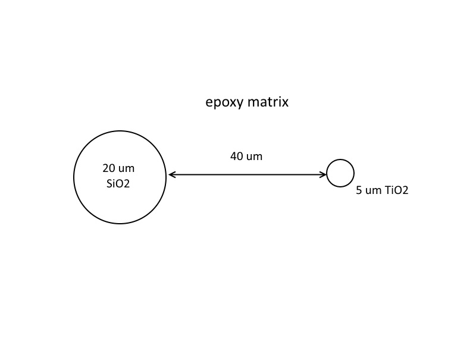

# Introduction

This introduction comes from the Probe Software Forum [here](https://probesoftware.com/smf/index.php?topic=58.msg8146#msg8146).

> I am reminded of a talk I heard here a few weeks ago from a highly regarded
> Professor at a California school which shall remain nameless.  There was a
> particular slide claiming to see differential diffusion profiles towards a
> grain boundary.  Some quick modeling after the talk showed that it could all
> be explained by secondary fluorescence.  I know the three Jo/h/n's (Wade,
> Donovan, and Fournelle) are adamant about trying to educate the public.
> What can we do to actually make this point sink in? 
> 
> Anyways:  There are essentially two solutions to this problem as Ben mentioned
> 
> 1. Acquire the data normally and run it through PENEPMA, modeling the influence
> of secondary fluorescence.  Then removing the influence of secondar
> fluorescence on each data point during the transect towards the grain boundary.
> A bit time consuming right now, but I wonder if PfEPMA wouldn't be able to do
> that quite easily now that is has the modeling built in...
> 
> 2. Alternatively use the non-traditional lines J.D. mentioned and use low
> accelerating potential (<8 keV).  The influence of secondary fluorescence goes
> away for most elements in this case.  You could also use the normal L lines
> if all you are after is the diffusion profile, and not absolute concentrations.

John Donovan noted:

> I realize this is a two year old post, but it's worth mentioning again that
> now there is a geology paper on these SF effects:
> [here](https://www.sciencedirect.com/science/article/pii/S0009254118302304).
>
> Here's the geometry for a .geo file that we need from a Penepma .geo file
> expert:

[Phillipe Pinard](https://probesoftware.com/smf/index.php?topic=58.msg8172#msg8172)
supplied the [.geo](./inc/sio2-epoxy-tio2.geo) file.
