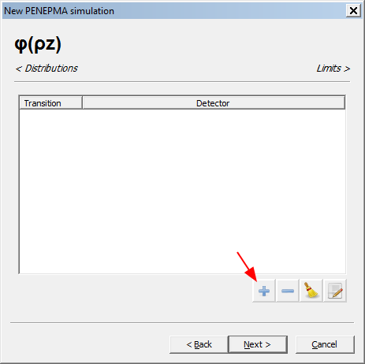

# Introduction

# Procedure

## Define the new simulation

When we start a new simulation we are greeted by a Welcome Screen. Enter a
name for the simulation and choose a folder for the results using the GUI as
shown below. Then press the `Next` button.

## Set the microscope voltage

Set the appropriate microscope voltage and take-off angle. Then press the
`Next` button.

## Choose the multilayer geometry

The Default simulation is a `Substrate`. Use the pull-down window to select
`Multilayer(s)` which is the last choice in the menu. You will see a 
Window that looks like this. Press the `+` box to add a material .

## Start definition of the substrate material

When you first see the dialog the values will be empty and the top box will
be checked and the bottom box will not be checked.

1. Uncheck the top box and enter the name of the material, in this example
`Fe`.

2. Check the bottom box to select a user-supplied density. In this example I
wanted to test how the density setting changed the output and used a high
density of 10.

The `+` button gives you a nice periodic table to make a selection

When you are done press `OK` and finish adding the input

When you are done press `OK`

Now we want to set the substrate to `Fe`.

You will get an `Edit layer` box that looks like this

after setting the substrate to Fe it should look like this

Then press `+` and add a material for the thin film.
Choose C with a density of 2.26 g/cm3

## Add the C layer

The window should look like this

Now:

Note how you get the default layer window with `Vacuum` highlighted and
a thickness of 10 nm.

Use the pull-down window to select `C` and set the
thickness to `200.0` nm.

The window should look like this

Then you can press `OK`  and will get

We now have the geometry configured so we can go to the next
menu.

## set the simulation parameters

We now get the base parameters menu

I usually click and un-click the default check-box and look at the papers
by Llovett and Salvat
to see if I should change them. Note how the values have changed from the
defaults.

## set the interaction forcing parameters

Press `Next` to go to the `Interaction Forcing` menu. I click the
`default` button and start there.

Press `Next` to set the photon detectors

## Set the Photon Detectors

You can have many by default. I start with the default detectors

and delete all but the last 

and then edit the parameters

The most important parameter are the low and high energy values. We want to
use out maximum of 1000 channels to cover our desired transitions.

When finished press next

## Set the Distribution parameter

We start with this menu

And edit to fit the system

Now we can go to the phi-rho-z menu

## Phi-Rho-Z

We start with the base menu and add transitions using the `+` button

And add the C Ka

Repeat for the FeKa and Fe La and the final window looks like this

We can the move on with `Next`

## Configure limits

Here we configure limits. One can use number of showers (trajectories),
time (in sec), or uncertainty of the intensity of a transition.

The default I set here is `28800` sec (8 hrs).

I find it difficult to select a uncertainty value for a new system
because the simulation time increases with the inverse square of the
uncertainty. I found it hard to predict values that would not be cut-off
by a reasonable time limit (8 to 40 hrs). 

Then we press `Finish`. This writes the multilayer
[xml](./xml/multilayer-no-vacuum.xml)
file which does not contain the `vacuum` dummy layer.

